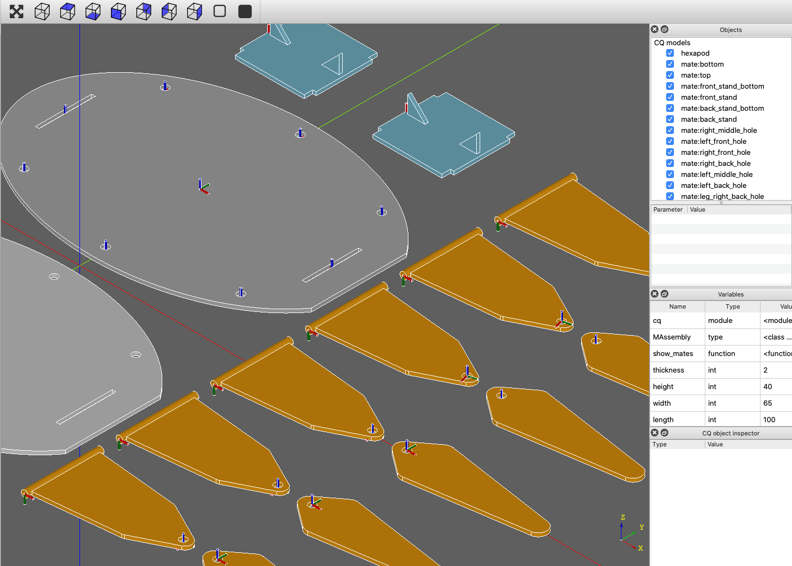
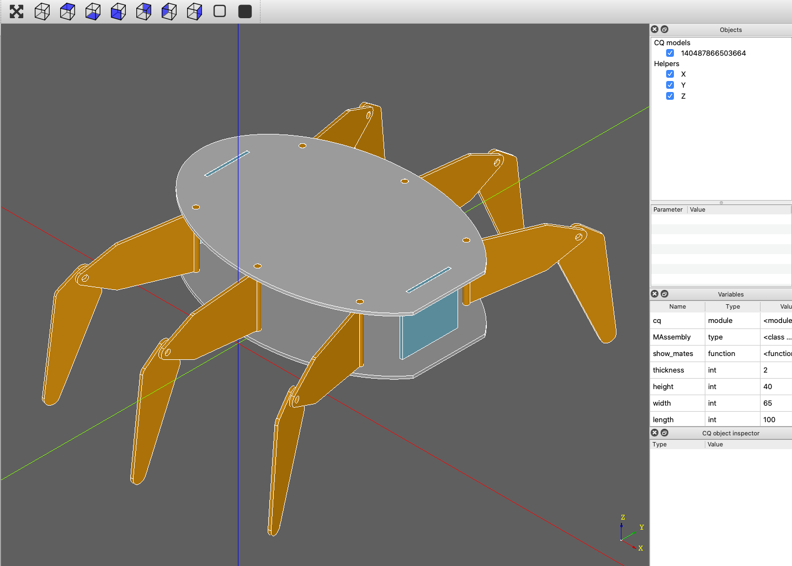
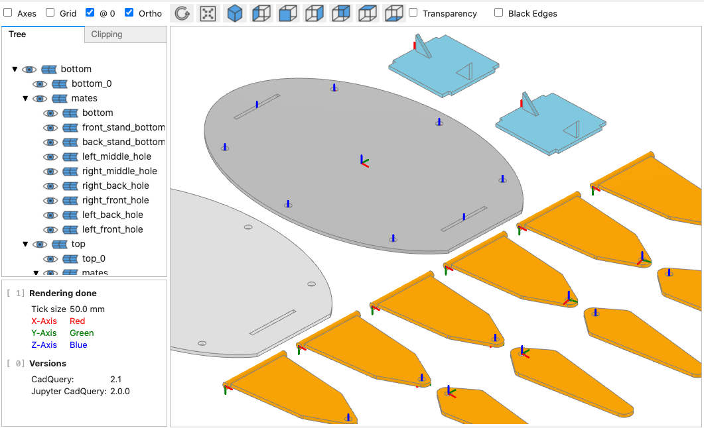
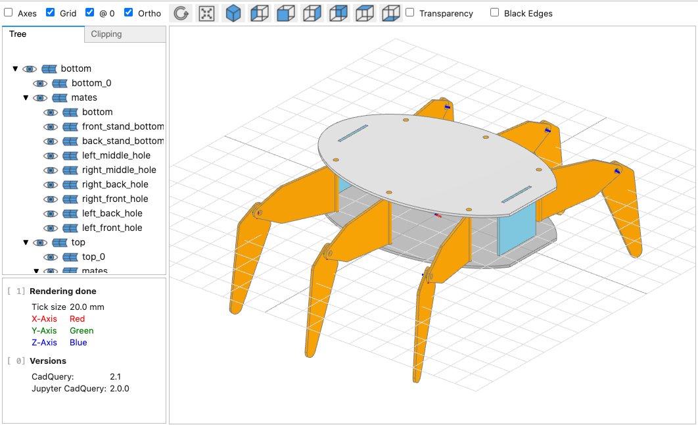
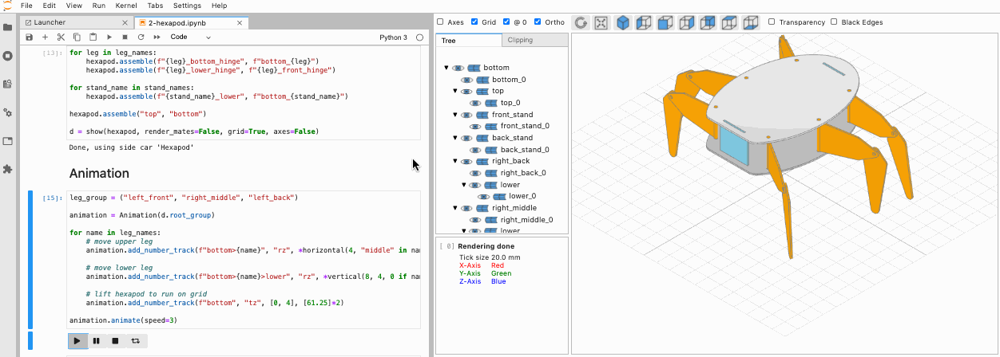

# MAssembly for *CadQuery*

## Intro

CadQuery provides an solver based assemblies.

`MAssembly` is derive from `cadquery.Assembly`, however, allows to define mates which will be used to manually assemble the objects.

### Mate definitions

- Method `mate`:

    ```python
    def mate(
        self, query: str, name: str, origin: bool = False, transforms: Union[Dict, OrderedDict] = None
    ) -> "MAssembly":

    def mate(
        self, id: str, mate: Mate, name: str, origin: bool = False, transforms: Union[Dict, OrderedDict] = None
    ) -> "MAssembly":
    ```

- Example:

    ```python
    from collections import OrderedDict as odict

    hexapod = create_hexapod()

    hexapod.mate("bottom?top", name="bottom", origin=True)
    hexapod.mate(
        "top?bottom", name="top", origin=True, transforms=odict(rx=180, tz=-(height + 2 * tol))
    )
    ```

Full code see [2-hexapod.py](./examples/cq-editor/2-hexapod.py)

### Final assembly

- Method `assemble`

    ```python
    def assemble(self, object_name: str, target: Union[str, Location]) -> Optional["MAssembly"]:
    ```

- Example

    ```python
    check_mates = False
    if check_mates:
        show_object(hexapod, name="hexapod")
        show_mates(hexapod, show_object, length=5)
    else:
        # Assemble the parts
        for leg in leg_names:
            hexapod.assemble(f"leg_{leg}_lower_hole", f"leg_{leg}_hole")
            hexapod.assemble(f"leg_{leg}_hinge", f"{leg}_hole")
        
        #   ...

        show_object(hexapod)
    ```

Full code see [2-hexapod.py](./examples/cq-editor/2-hexapod.py)

### Visualisation

### CQ-Editor

- Check mates view (`check_mates = True`)

    

- Assembled view (`check_mates = False`)

    

### Jupyter Cadquery

Details see [jupyter-cadquery](https://github.com/bernhard-42/jupyter-cadquery)

- Check mates view
    
    

- Assembled view 

    

Jupyter CadQuery additionally supports animating the object

